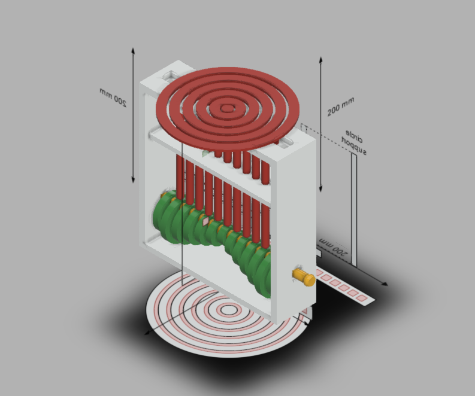

# Final Project - Water Drop Mechanism (Rapid Prototyping) 

'Seeing how important it is to understand the meaning of Rapid Prototyping, the Final Project consists of creating a prototype of a specific mechanism.'

For my final project I had to model a Water Drop Mechanism using what I learned during the semester. I choose this mechanism because I saw it before taking the course, and I wanted to design a version of it too. The modeling and rendering was done using Autodesk Fustion 360. 

The idea behind the mechanism can be summarised using this gif:

The rod rotates and it pushes the top circles up and down. The difference in size and angle between the circles makes the motion to appear wavelike.

There are 3 .f3d files in the f3ds folder:
* water-drop-old.f3d - attempt at making the mechanism, discontinued since the second checkpoint
* water-drop-mech.f3d - the basic version of the mechanism
* water-drop-mech-style.f3d - a polished version of the mechanism, which is less blocky, but may be harder to 3D print

The .stl files can be found in the stls folder. The water-drop-mech-style.f3d can be seen [here](https://a360.co/3d9ciQR).

To see the motion you would need to open the .f3d file (water-drop-mech.f3d or water-drop-mech-style.f3d) and use the motion study (rod-rotation). 

The joints used are revolute joint for the support circles, and slide joints for the top circles. The support circles are connected with motion links so they can move together.

Below are the checkpoints that I had to reach, gifs and photos that I took directly from Fusion, some rendered photos, the mechanism in Prusa Slicer, with my explanations and the resources that I used to make this project added near the end.

# Checkpoints:

### 1. Checkpoint (water-drop-old.f3d):

* 1. Divide your project into components ✔️
* 2. Start sketching and creating the objects ✔️

### 2. Checkpoint (water-drop-mech.f3d):

* 1. Finish creating all objects ✔️
* 2. Add working joints ✔️
* 3. Add appearance ✔️

### 3. Checkpoint:

* 1. Start the design from the canvases created by yourself for Homework no. 6. ✔️
* 2. Save multiple versions and suggestively name them. ✔️
* 3. Properly use and name bodies, components, joints, construction, planes, etc. ✔️
* 4. Render the object applying appearance and scene. ✔️
* 5. Save the renderings as photos and as a turntable Render. ✔️
* 6. Add joints, motion links and joints limits. ✔️
* 7. Create motion studies. ✔️
* 8. The mechanism needs to work properly! ✔️

The turntable render is found in the 'images' folder as a .mp4.

### Bonus:
* I kept in mind this should be 3D printed. It can be printed and assembled without too much trouble.
* Made the mechanism in a way that makes it easy for the user to modify the movement of the top circles.

# Media:

## The sketches used to make the mechanism:

## The mechanism working in Fusion 360:

#### The low framerate is because I used Contact Sets, and the circles make it harder for the machine to compute the movement.

## The mechanism in Prusa:

## The polished version of this mechanism (I used metallic paint for appearance):

# Explanations: 
* For checkpoint 2 I tried to model it only using the canvases that I made in homework 6. While trying to add joints I figured out that I should start over and measure the objects before I create them. Even with measurements in Fusion, and some calculations made on paper, I had some problems with the circles (fixed them quickly using some tricks with the sketches).
* There is a slight difference in height between some of the objects in the .f3d project. That's because Fusion and I had some troubles with the Contact Sets, and I had to make them smaller. It doesn't affect the mechanism.
* The naming convention, because I worked with mirrored object was to make them 'm 1/n', with n being the number of objects of type m in the scene.

---
# Resources used:
* 3DMP Courses & Labs from Ana & Corina
* Fusion 360
* PrusaSlicer
* [Reddit](http://reddit.com/r/fusion360)
* [YouTube - Water Experiment](https://www.youtube.com/watch?v=ZqzjAmPFND8) 
* [YouTube - A Drop of Water](https://www.youtube.com/watch?v=7Hv85T7mbnE)
* [Thingverse](https://www.thingiverse.com/thing:2542655)
* [GrabCad](https://grabcad.com/library/water-drop-effect-1)
* [draw.io](draw.io) 

# Credits:
* The mechanism is made by me, with the help of the resources linked above
* There are more version of this thing on the Internet, but my main inspiration is the automata made by  Dean O’Callaghan (linked above in the 'Water Experiment' YouTube video), that was inspired by the work of Reuben Margolin (most likely his round wave sculpture).
