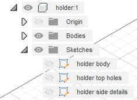

# Final Project - Water Drop Mechanism (Rapid Prototyping) 

For my final project I had to model a Water Drop Mechanism using what I learned during the semester. The end resuls should look and work like [this (Water Experiment)](https://www.youtube.com/watch?v=ZqzjAmPFND8) or [this (A Drop of Water)](https://www.youtube.com/watch?v=7Hv85T7mbnE). 

There are 3 .f3d files in the f3ds folder:
* water-drop-old.f3d - attempt at making the mechanism, there is an explanation at the bottom of the file.
* water-drop-mech.f3d - the actual mechanism that I used for most of the pictures below
* water-drop-mech-style.f3d - this version uses a less blocky appereance, but it's a little bit harder to print (needs supports)

The .stl files can be found in the stls folder. 

Below are gifs and photos that I took directly from Fusion, some rendered photos, the mechanism in Prusa Slicer, the checkpoints that I had to reach, with my explanations added near the end, and the resources that I used to make this project.

---
# Media:

## The sketches used to make the mechanism:

## The mechanism rendered:

### The turntable render is found in the 'images' folder as a .mp4.

## The mechanism working in Fusion 360:

### The lag is because I used Contact Sets, and the circles make it harder for the machine to compute the movement.

## Some parts for the mechanism in Prusa:

## Pics that show the work that corresponds to the checkpoints below (names, joints, joints limits, motion study, and components):

## And at last, the pretty version of this mechanism:

---

# Checkpoints:

### 1. Checkpoint (water-drop-old.f3d):

* 1. Divide your project into components ✔️
* 2. Start sketching and creating the objects ✔️

### 2. Checkpoint (water-drop-mech.f3d):

* 1. Finish creating all objects ✔️
* 2. Add working joints ✔️
* 3. Add appearance ✔️

### 3. Checkpoint:

* 1. Start the design from the canvases created by yourself for Homework no. 6. ✔️
* 2. Save multiple versions and suggestively name them. ✔️
* 3. Properly use and name bodies, components, joints, construction, planes, etc. ✔️
* 4. Render the object applying appearance and scene. ✔️
* 5. Save the renderings as photos and as a turntable Render. ✔️
* 6. Add joints, motion links and joints limits. ✔️
* 7. Create motion studies. ✔️
* 8. The mechanism needs to work properly! ✔️

### Bonus:
* I kept in mind this should be 3D printed. It can be printed and assembled without too much trouble.
* Made a pretty version of the mechanism (water-drop-mech-style.f3d). Maybe it looks better, but there are some parts that are harder to 3D print.

---
#### Explanations: 
* For checkpoint 2 I tried to model it only using the canvases that I made in homework 6. While trying to add joints I figured out that I should start over and measure the objects before I create them. Even with measurements in Fusion, and some calculations made on paper, I had some problems with the circles (fixed them quickly using some tricks with the sketches).
* There is a slight difference in height between some of the objects in the .f3d project. That's because Fusion and I had some troubles with the Contact Sets, and I had to make them smaller. It doesn't affect the mechanism.
* The naming convention, because I worked with mirrored object was to make them 1/n, with n being the number of objects in the scene.

---
### Resources used:
* 3DMP Courses & Labs from Ana & Corina
* [Reddit](http://reddit.com/r/fusion360)
* [draw.io](draw.io) to draw the meachanism
* [this](https://www.youtube.com/watch?v=ZqzjAmPFND8) video as a reference
