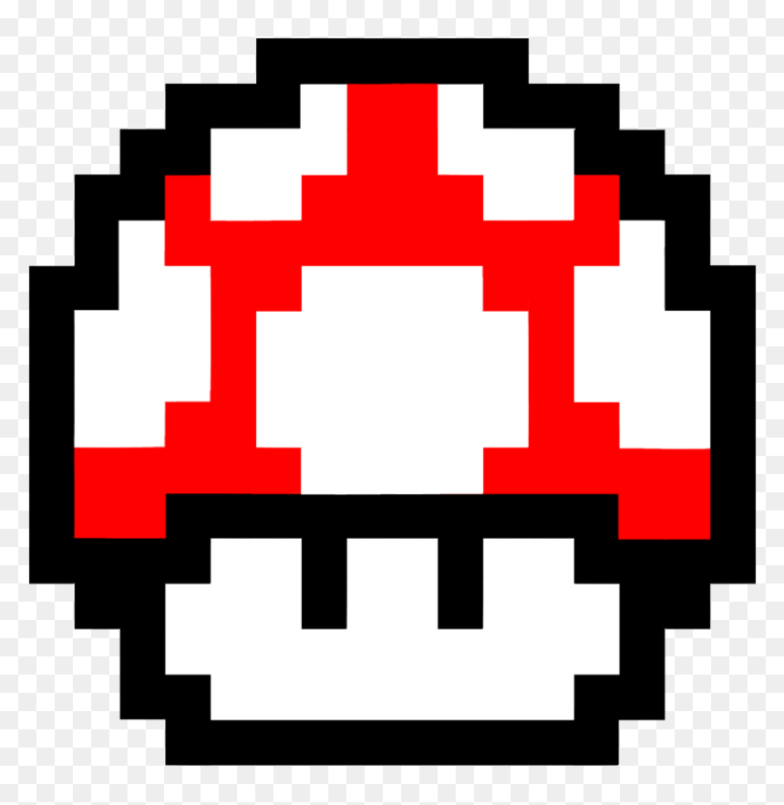
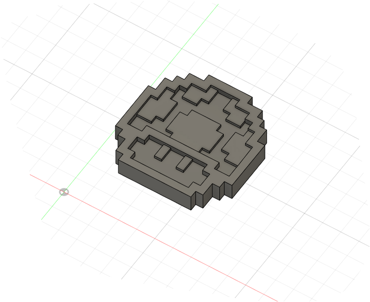
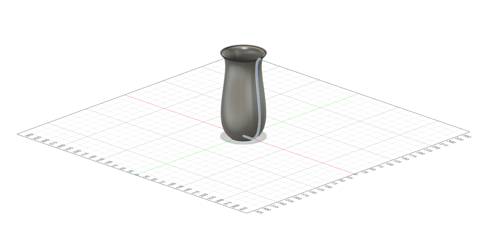
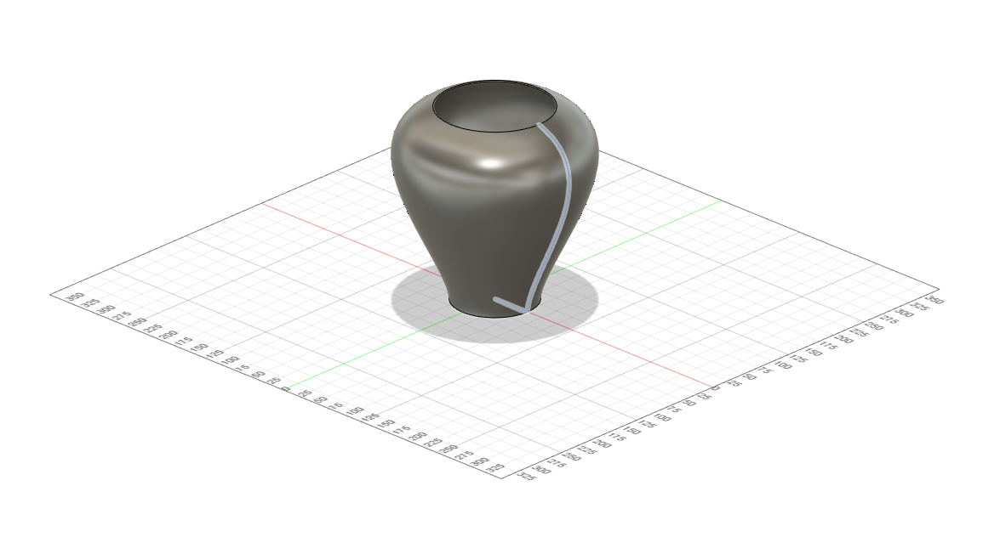

# Homework 1

### 1. Create a 3D pixel art style keychain. By starting from a 2D sketch you need to fit those specific dimensions: 10 cm (X) x 7 cm (Y) x 1 cm (Z)

I tried to make one of those mushrooms from Mario.

#### Reference:

#### Result:

### 2. Create a 3D model vase starting from a 2D sketch

### 3. Edit the vase shape by modifying the 2D sketch

### 4. Slice both models in Prusa Slicer using different ways to find out the optimal time for printing

#### The Mushroom in Prusa (~1h30m to print):
![Mushroom-Prusa.PNG](img/Mushroom-Prusa.PNG]

#### Vase in Prusa:
![vase-prusa.PNG](img/vase-prusa.PNG]
 
