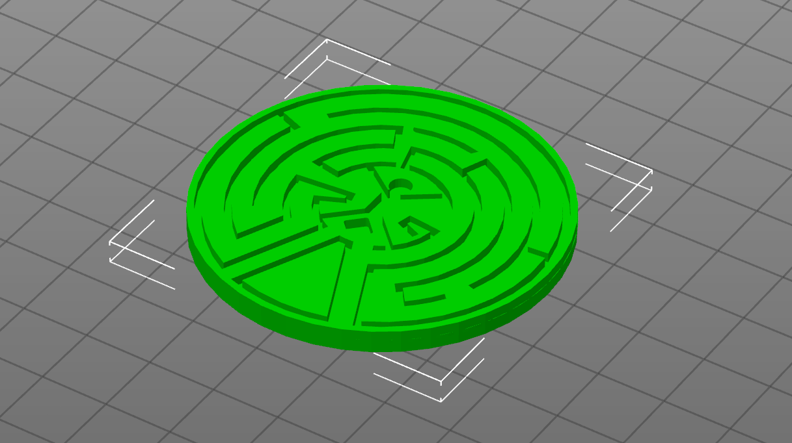
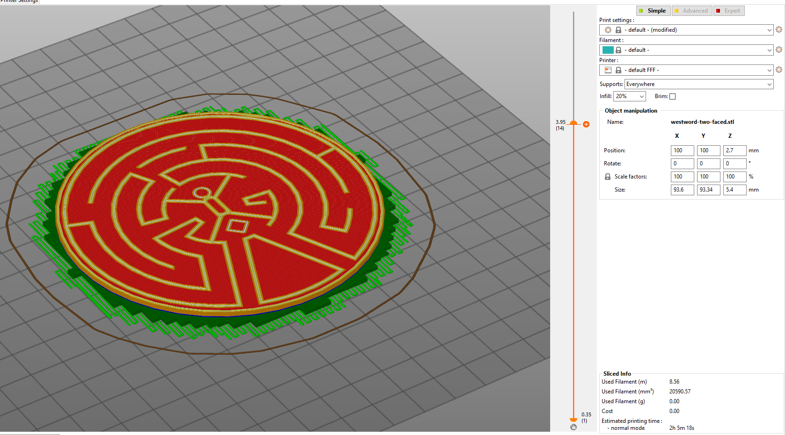
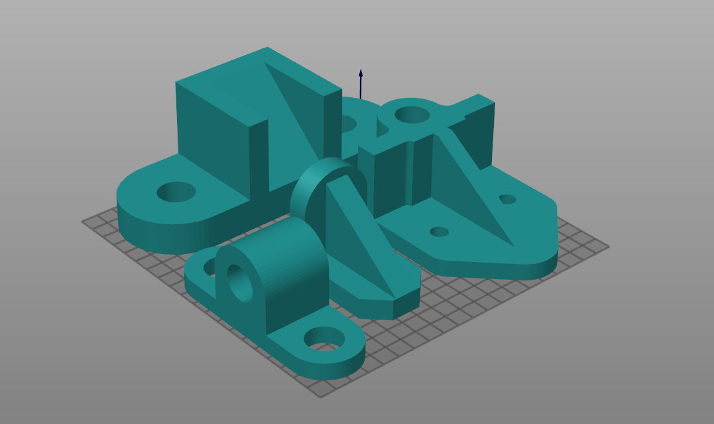
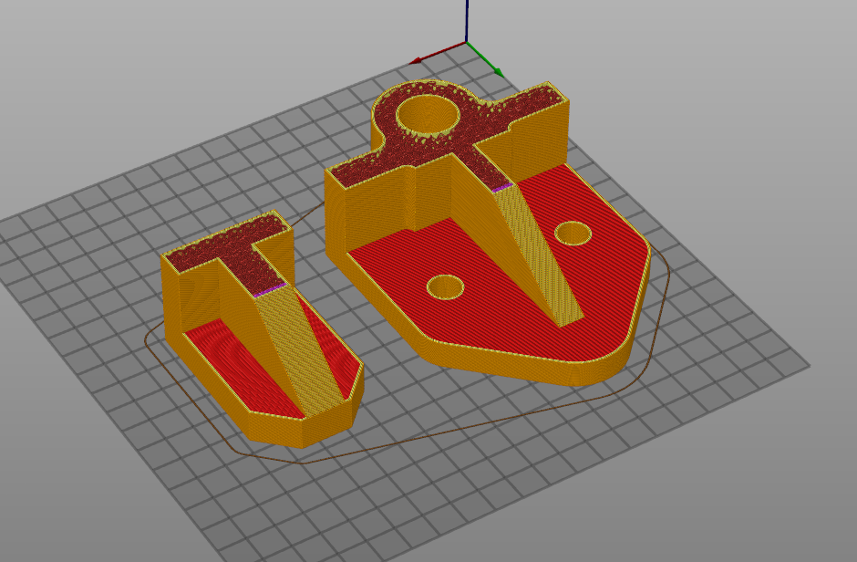
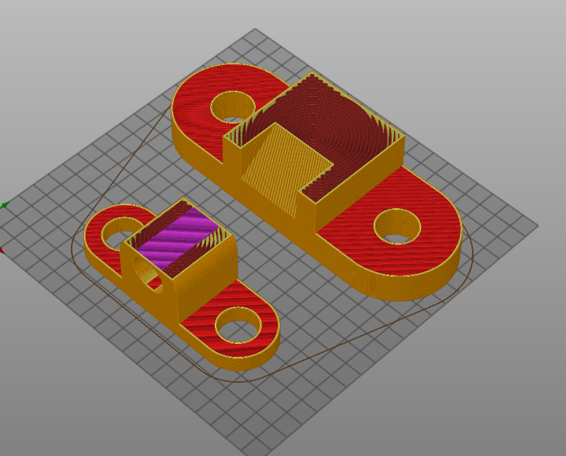

# Homework 1

### 1. Download a model from Thingiverse and modify it. Slice it for 3D printing and make a screenshot of the slicer window with the sliced object and the selected option. Think of an useful improvement. If you’re happy with the new design, upload it as a remix of the original.

I downloaded a model (a puzzle from the TV show Westworld) and made it two-faced. Then I sliced it.

### 2. Model model A1, A2, A3, A4

A1 - A4:

A1 and A3 sliced:

A2 and A4 sliced:

