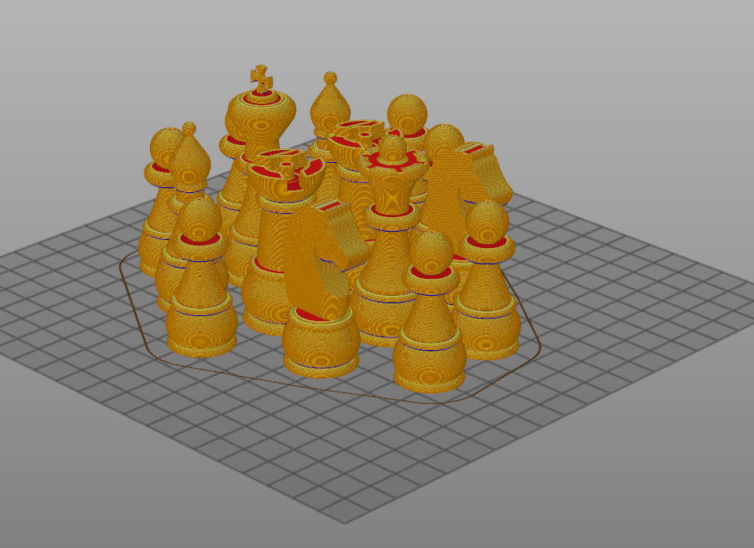

# Homework 3

### 1. Design a chess piceses set using the SVG sketch.

### 2. Slice all the pieces in PrusaSlicer (Estimated printing time: 7h 30m)

### BONUS: Make the board as well, add appearance:

