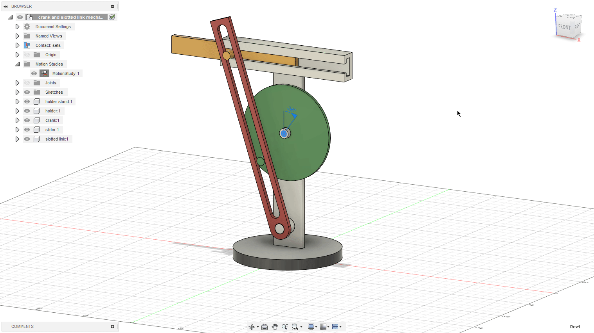
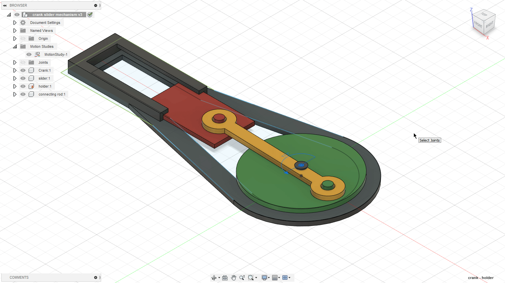
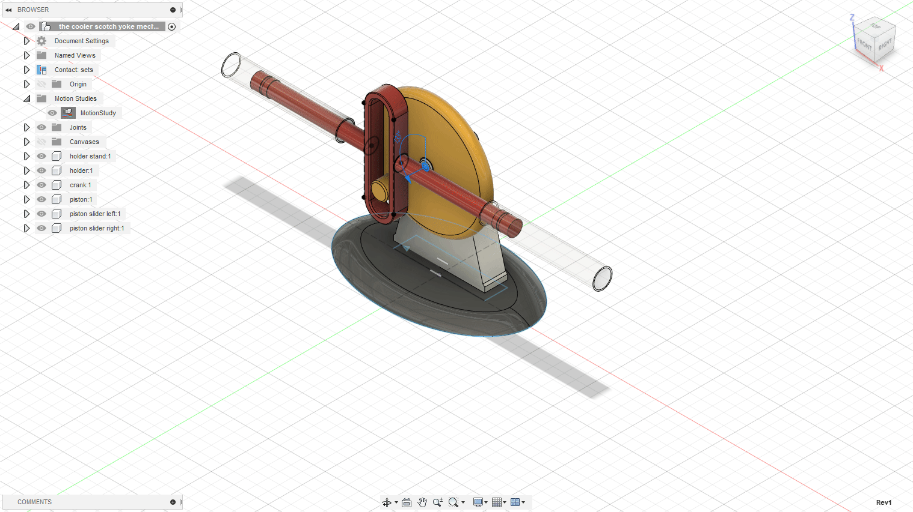

# Homework 4

### 1. Design the Scotch Yoke Mechanism taking the course videos as reference(especially the slider crank mechanism; in this one can see why it’s important to use Fusion Rule Number 1)

#### The first course had us designing a Crank and Slotted Link Mechanism:

#### The second course helped us to design a Crank Slider Mechanism:

#### The homework, to design a Scotch Yoke Mechanism:

### 2. Create a scene with a twisted column on a polygon surface (WIP)
