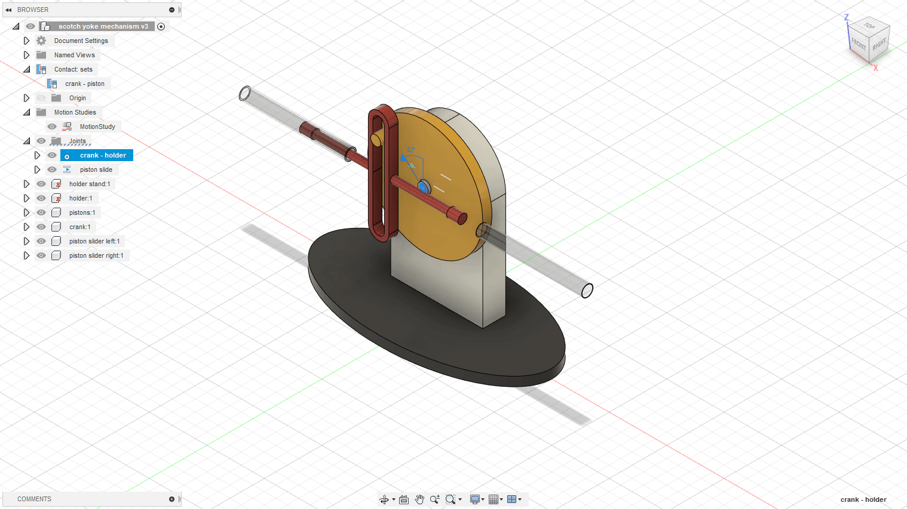

# Homework 4

### 1. Design the Scotch Yoke Mechanism taking the course videos as reference(especially the slider crank mechanism; in this one can see why it’s important to use Fusion Rule Number 1)

### 2. Create a scene with a twisted column on a polygon surface (WIP)
