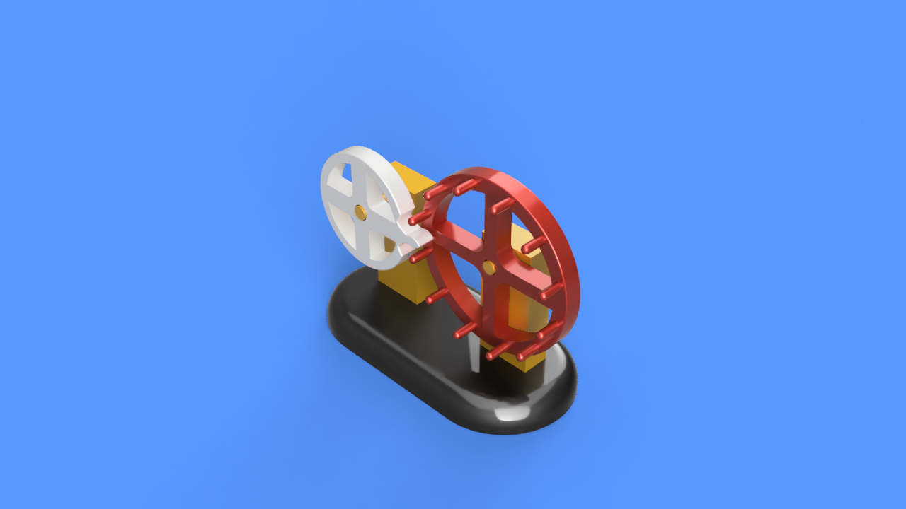
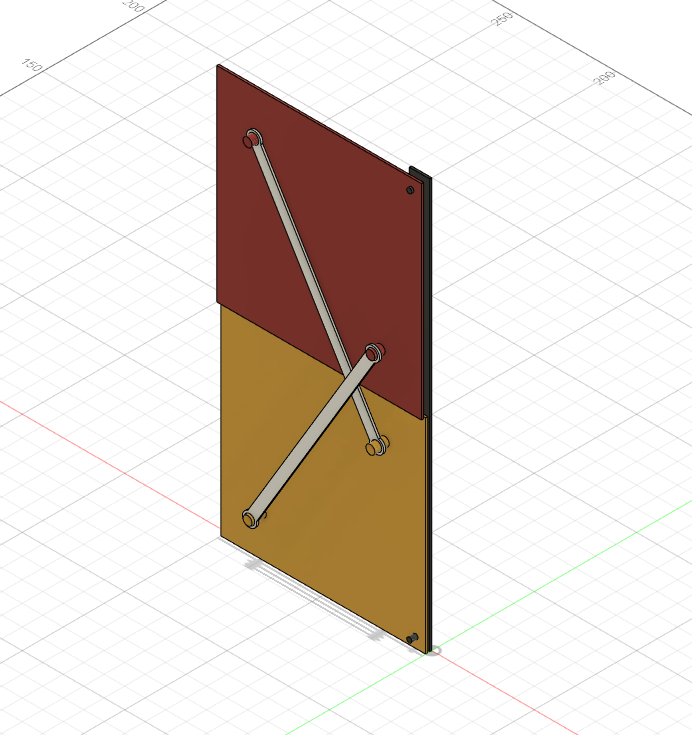

# Homework 3

### 1. Choose a mechanism from the next list and design it in Fusion:

- [ ] https://tinyurl.com/y8zgkzjq
- [ ] https://tinyurl.com/ycxhnskp
- [ ] https://tinyurl.com/ycc3mrls
- [ ] https://tinyurl.com/ybxq84ko
- [x] https://tinyurl.com/y9uww3b8
- [ ] https://tinyurl.com/y94sx6om
- [ ] https://tinyurl.com/y7jvyma3
- [ ] https://tinyurl.com/ydabljd6

#### I just watched the GIF until I understood. It was a lot of trial and error because I had no reference.
#### The end result is a little different because I cut what I considered to be useless material.

### 2. Add joints and create a motion study:

### 3. Add appearances and render the mechanism (upload a rendering photo to GitHub as well):

### BONUS: Design the evolution door following 2-7 steps from the homework tasks.

I tried to make the door, but it doesn't actually move (I played with the joints, but it just glitches)

