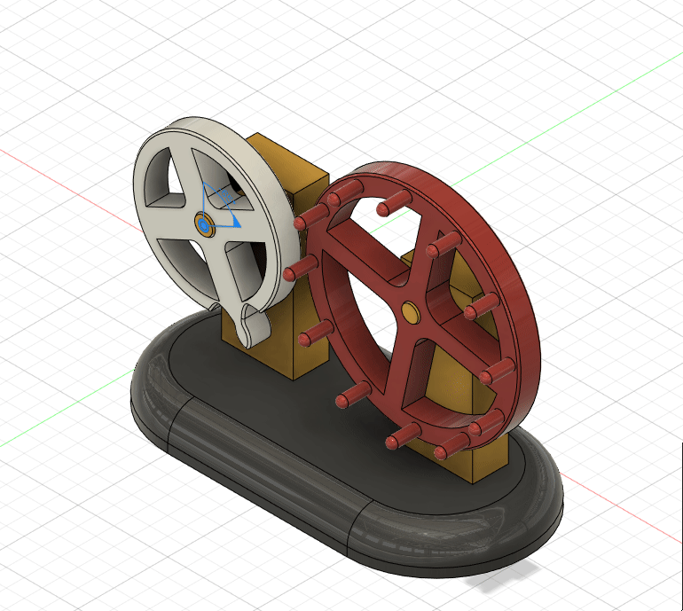

# Homework 3

### 1. Choose a mechanism from the next list and design it in Fusion:
 *a. https://tinyurl.com/y8zgkzjq
 *b. https://tinyurl.com/ycxhnskp
 *c. https://tinyurl.com/ycc3mrls
 *d. https://tinyurl.com/ybxq84ko
 *e. https://tinyurl.com/y9uww3b8 - THIS ONE
 *f. https://tinyurl.com/y94sx6om
 *g. https://tinyurl.com/y7jvyma3
 *h. https://tinyurl.com/ydabljd6

#### I just watched the GIF until I understood. It was a lot of trial and error because I had no reference.
#### The end result is a little different because I cut what I considered to be useless material.

### 2. Add joints and create a motion study:

### 3. Add appearances and render the mechanism (upload a rendering photo to GitHub as well):

### BONUS: Design the evolution door following 2-7 steps from the homework tasks.

To be uploaded...
